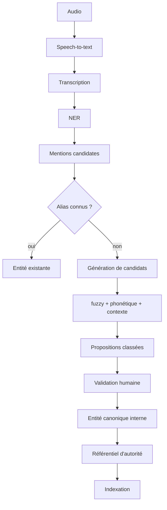

# Résolution d'entités (Entity Resolution)

Cette page documente l'étape de **rapprochement des mentions** détectées
par le NER.

## 1. Résolution d'entités et Entity Linking : deux notions distinctes

Le projet teste d'abord la **résolution d'entités** : déterminer si
plusieurs mentions textuelles peuvent correspondre à une **même entité
réelle**.

Exemple : les formes suivantes peuvent potentiellement désigner la même
personne :

```
Marie Dupont
Marie Dupond
M. Dupont
```

Le **rattachement à un référentiel d'autorité externe** (IdRef, Wikidata,
VIAF, ...) constitue ensuite l'**Entity Linking** au sens documentaire.

Dans le cas d'étude, le scénario envisagé est :

```
mentions -> entité interne validée -> IdRef
```

mais le code reste **indépendant d'IdRef** et de tout autre référentiel.

## 2. Méthodes de rapprochement testées

Deux scripts explorent plusieurs stratégies :

- `src/benchmark_linking.py` ;
- `src/benchmark_linking_final.py`.

Les méthodes comparées sont :

1. **normalisation exacte** : comparaison des formes après mise en forme
   (minuscules, accents supprimés, ponctuation retirée, civilités
   retirées) ;
2. **fuzzy matching** (rapprochement approximatif) ;
3. **comparaison phonétique** ;
4. **embeddings** (comparaison de contexte) ;
5. **combinaison fuzzy + phonétique** ;
6. **combinaison fuzzy + phonétique + contexte**.

### Définitions (pour un lecteur non informaticien)

- **Fuzzy matching** : mesure la ressemblance entre deux chaînes de
  caractères même lorsqu'elles ne sont pas écrites exactement de la même
  façon. Ici, via la bibliothèque `rapidfuzz` (score `WRatio`).
- **Comparaison phonétique** : cherche à déterminer si deux noms peuvent
  se prononcer de manière similaire malgré une orthographe différente. Ici
  via l'algorithme **Double Metaphone** (`metaphone`).
- **Embedding** : représentation numérique produite par un modèle
  d'intelligence artificielle permettant de comparer des textes selon
  leurs caractéristiques ou leur contexte. Ici via
  `sentence-transformers`.
- **Contexte** : mots et phrases entourant une mention dans la
  transcription (par défaut, ± 500 caractères autour de la mention).

## 3. Modèles d'embeddings utilisés

| Script | Identifiant | Usage | Licence | Source |
|---|---|---|---|---|
| `benchmark_linking_final.py` | `BAAI/bge-m3` | comparer le **contexte** des mentions | MIT | https://huggingface.co/BAAI/bge-m3 |
| `benchmark_linking.py` | `sentence-transformers/paraphrase-multilingual-mpnet-base-v2` | comparer les formes de noms | Apache-2.0 | https://huggingface.co/sentence-transformers/paraphrase-multilingual-mpnet-base-v2 |

`BAAI/bge-m3` est un modèle d'**embeddings** multilingue. Il est utilisé
**uniquement** pour comparer le contexte des mentions. Ce n'est **pas** une
autorité documentaire : il ne décide pas de l'identité d'une personne.

Comme pour les modèles NER, les poids ne sont pas distribués dans le dépôt :
ils sont téléchargés par `sentence-transformers`.

## 4. Paramètres des expériences

### `benchmark_linking.py`

| Paramètre | Valeur |
|---|---|
| Seuils fuzzy testés | 75, 80, 85, 90, 95 |
| Seuil de fusion (fuzzy + phonétique) | 82 |
| Score fuzzy minimal pour la combinaison | 65 |
| Voisins embeddings | 10 |
| Seuil embeddings | 0.72 |
| Longueur minimale d'une mention | 3 |

### `benchmark_linking_final.py`

| Paramètre | Valeur |
|---|---|
| Top-k candidats par forme | 5 |
| Score fuzzy minimal pour être candidat | 75 |
| Contexte autour de la mention | ± 500 caractères |
| Contextes conservés par forme | 3 |
| Regroupement : score de nom minimal | 90 |
| Regroupement : score phonétique minimal | 75 |
| Regroupement : similarité de contexte minimale | 0.70 |
| Regroupement : score combiné minimal | 82 |
| Modèle d'embeddings | `BAAI/bge-m3` |

Score combiné (méthode « fuzzy + phonétique + contexte ») :

$$ \text{score} = 0{,}50 \times \text{nom} + 0{,}20 \times \text{phonétique} + 0{,}30 \times (\text{contexte} \times 100) $$

L'orthographe reste volontairement le signal principal ; la phonétique
capte les erreurs de reconnaissance vocale ; le contexte aide à
désambiguïser.

## 5. Les regroupements sont des candidats, pas des vérités

C'est un point essentiel : les regroupements produits automatiquement sont
des **candidats**, des **suggestions**, des **propositions de
rapprochement**. Ce ne sont **jamais** des entités validées.

Le code et la documentation ne doivent jamais laisser entendre qu'un
groupe automatique représente nécessairement une personne réelle unique.
La décision documentaire finale reste **humaine**.

## 6. Architecture générique cible



- le **NER** peut utiliser des modèles d'intelligence artificielle ;
- le **contexte** peut être comparé avec un modèle d'embeddings IA ;
- le **fuzzy matching** et les méthodes **phonétiques** sont des
  algorithmes classiques (non IA) ;
- la **décision documentaire finale** reste humaine.

## 7. Référentiels d'autorité

Le dépôt est **neutre** vis-à-vis du référentiel : l'entité validée peut
ensuite être reliée à :

- IdRef ;
- Wikidata ;
- VIAF ;
- un référentiel interne ;
- tout autre référentiel d'autorité ou métier.

Dans le cas d'étude, le scénario envisagé est un **rattachement à
IdRef par les catalogueurs**. Cette fonctionnalité **n'est pas encore
implémentée** dans le benchmark.

## 8. Gold standard et métriques futures

Aucun gold standard humain complet n'était disponible. L'objectif est
d'utiliser les validations / corrections des catalogueurs pour constituer
progressivement un gold standard. Celui-ci permettra de calculer :

- **Precision** : parmi les entités proposées, quelle proportion est
  correcte.
- **Recall** : parmi les entités réellement présentes, quelle proportion a
  été retrouvée.
- **F1-score** : moyenne harmonique de Precision et Recall.
- **Entity Linking Accuracy** : proportion de mentions correctement
  reliées à la bonne entité (interne ou de référentiel).
- **Top-k candidate recall** : proportion de cas où la bonne entité figure
  parmi les *k* premiers candidats proposés.

## 9. Commandes

```bash
# Expérience finale (fuzzy / phonétique / contexte + embeddings BAAI/bge-m3)
python src/benchmark_linking_final.py \
  --ner-results results/sauerkraut_gliner \
  --transcriptions transcriptions \
  --output results/linking_final

# Expérience précédente (normalisation exacte, fuzzy, phonétique, embeddings mpnet)
python src/benchmark_linking.py \
  --ner-results results/sauerkraut_gliner \
  --output results/linking
```
